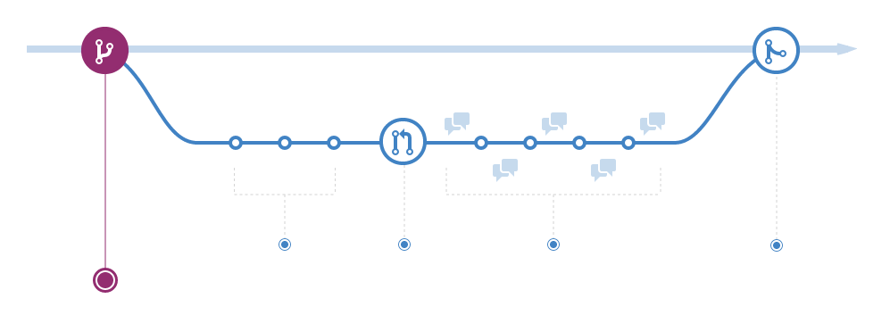

<style>
img[alt~="center"] {
  display: block;
  margin: 0 auto;
}
</style>

# Open Source Workshop: Version Control with Git
## February 2022
##


---
<!-- paginate: true -->
# Overview
1. What is Version Control and why do you need it?
2. What is Git?
3. Git within DNB
4. Your Turn

<!-- ---
# Some remarks to begin
- Feel free to interrupt me when you have questions
- This is an introductory workshop, but ... -->

<!-- ----------------------------------
VERSION CONTROL
--------------------------------------->
---
# What is Version Control?
- Tracking and managing changes to software (code).
- Changes are tracked in a special kind of 'database'.
- Make a mistake? You can turn back to a previous version of your code.

--- 
# So what problems does it solve?
- Who made changes to what file?
- `code_final`, `code_finalv2`, `code_latest`, ...
- Not having to keep outcommented code in your code base for later use.
  
    ```python
    # def calculate_price(number_of_items):
    #    return number_of_items * 3 
    def calculate_price(item_name: str, number_of_items: int) -> dict:
        return {item_name: number_of_items * 3}
    ```

<!-- ----------------------------------
INTRO TO GIT
--------------------------------------->
---
# What is Git?
- A type of version control system: software for tracking changes in files.
- Created in 2005, by Linus Torvalds (Linux!).
- By far the most popular and widely used version control system right now.

--- 
# Github, Bitbucket, Azure DevOps, Gitlab :worried:?
- Important to realize that they have one thing in common: **they all support Git as the underlying version control system**.
- This means that if you are familiar with Git, **it does not matter which provider you are using**. You will be using the same commands.
- Only provide different interfaces and toolsets.
  
    

---
# Getting Started with Git
- Git thrives in situations where you are collaborating with others, for example project team members.
- Git is software which you [download](https://git-scm.com/) in order to work with it. 
- Git can build a new project directory for you in which it creates a hidden folder where all you additions and changes are stored.
- The resulting snapshots of changes can be used to go back to a version in the past.

---

# Some concepts
- **Repository**: a storage location for software (code)
- When you initialize a folder with Git, Git creates a hidden folder where it, among other things, stores your changes.
- Find a repository on Github you would like to experiment with? **Clone** the repository to a local directory on your computer.
- Once cloned to your computer, **origin** is the name of the remote repository you just cloned.

---
# Git is often used in a CLI


---
# How do I start a Git repository?
- There are multiple ways to start working in a Git repo on your computer:
  - Create a repository inside the version control interface software you are using, e.g. Azure DevOps, Github, etc. Use `git clone` to get that repository to your local computer.
  - Create a folder for your project, open a shell/terminal, type `git init`. 
- <span style="color:orange;">**Demo**</span>

---
# A Git project
<!-- Picture of branch -->
- We now have our project folder with a special hidden `.git` subfolder which will contain all the necessary metadata.
- We are on what you call the `main` **branch**. A **branch** is an independent line of development. The `main` **branch** can be seen as the 'default' branch.
- Note that we have not connected it to any place online; the repository is entirely local. 


<!-- TODO: THREE TREES HERE -->

--- 
<!-- Staging environment is confusing

A commit is a record of what changes you have made since the last time you made a commit. Essentially, you make changes to your repo (for example, adding a file or modifying one) and then tell git to put those changes into a commit.

Commits make up the essence of your project and allow you to jump to the state of a project at any other commit.

So, how do you tell git which files to put into a commit? This is where the staging environment or index come in. As seen in Step 2, when you make changes to your repo, git notices that a file has changed but won't do anything with it (like adding it in a commit).

To add a file to a commit, you first need to add it to the staging environment. To do this, you can use the git add <filename> command (see Step 3 below).

Once you've used the git add command to add all the files you want to the staging environment, you can then tell git to package them into a commit using the git commit command. 

Note: The staging environment, also called 'staging', is the new preferred term for this, but you can also see it referred to as the 'index'.
-->
# Making your first change
- **add & commit**; use either a terminal or some GUI
  - `git add <filename>` 
  - `git commit -m "Commit message describing what you have changed"`
- What this does is add your changes to a staging area, then register the changes to your **local repository**.
- Want to know which files are in which stage and which files are in which area? Use `git status`.
- Finally, **push** your changes to the remote repository: `git push` or `git push <remote> <branch_name>`. Note the remote is often called `origin`.

---
# A bit on Git's inner workings

<!-- - Internally Git uses 'three trees':
  - The **Working Directory**: in sync with the local filesystem
  - The **Staging Index**: changes that are tracked because they are added to the staging area, i.e. proposed next commit
  - The **Commit Tree**: the current branch -->


---
# Visually


---
# Undoing changes
- You can get an overview of your history of commits by using `git log`.
- There are multiple ways, depending on the use case, to undo changes.
- `git revert` is one of them. No history is deleted.


---
<!-- HOOGOVER HOUDEN -->
# Undoing changes
- There are multiple ways to undo changes you have made.
- How you undo changes depends on in which stage your change is.
- We won't go into detail on undoing changes, as it might be confusing at first.

---
# Branches
- You might want to try to extend a piece of code with something experimental. In this case, working on the `main` branch is not ideal.
- So, you create a new **branch** to develop a new feature or component: 
  `git checkout -b my-feature-branch`
- After you are done, you can merge your changes into the `main` branch, possibly before having had approval to do so (**code review** and **pull request!**), and remove your branch.

---
# :bulb: Quick summary of what've learned so far 
- Git stores the changes you are making in your local repo through a process of **staging** them, then **committing** and **pushing** them to the remote repo. **Pulling**, on the other hand, updates your local repository from the remote repo.
- Git works with **branches**: usually a `main` branch consists of code that is working and ready to be used. You work on code in different branches and **merge** completed code back into the `main` branch.

<!-- ---
# Merge Conflicts
- Occurs when Git is unable to automatically resolve differences in code between two commits.
- When merging, if a conflict arises, Git will ask you which code you wish to keep.
- Git adds to your conflicting files:
  ```
  <<<<<<< HEAD
  =======
  >>>>>>> new_branch_to_merge_later
  ```
- <span style="color:orange;">**Demo**</span> -->

---
# Let's revisit the `main` branch
- It's good practice, to review code that is relied on to always be in good shape before it gets to the `main` branch. 
- A **branching strategy** guides your team in working with version control effectively and consistently and lays out when code can be merged into the `main` branch.

---
# An example of a branching strategy
- Use feature branches for all new features and bug fixes.
- Merge feature branches into the main branch using **pull requests**.
  - A **pull request** (sometimes called merge request) is a request for review and merging of your code into the `main` branch.
- Keep a high quality, up-to-date main branch.
- There are many more workflows and strategies. Most importantly, **be consistent and agree upon a strategy with your team**.
 - <span style="color:orange;">**Demo**</span>

---
# Github Flow
- [Interactive Github Flow](https://guides.github.com/introduction/flow/)


---
# Some Git Best Practices
- Small, clean, logical commits; one thing at a time.
- Meaningful commit messages.
- Commit early, commit often; it does not have to be perfect.
- Double check what you are pushing to the remote repository: use a `.gitignore` file!

---
# Other things to keep in mind
- You do not need to know everything by heart. Use Google and Stackoverflow :slightly_smiling_face:!
- Cheat sheets can help.
- There is much more to Git than we covered today.
- Read up on the [**Data Science Manifest**](https://dnbnl.sharepoint.com/:b:/r/sites/tmp_KM-DNBDatascience/KnowledgeDocuments/DSH-Manifest.pdf?csf=1&web=1&e=mkF3tA) to learn about Best Practices when writing code.
  - Among version control, also concisely provides guidelines on coding practices, working together, testing and managing your project.


<!-- ----------------------------------
GIT IN DNB CONTEXT 
--------------------------------------->
---
# Git in DNB context
- Migrating towards Microsoft Azure Cloud.
- DNB is all into the Microsoft ecosystem:
  - Office (365): Word, Excel, Powerpoint, Outlook etc.
  - Skype, Teams, OneDrive, Sharepoint
  - Edge Browser
  - PowerBI
  - Azure

--- 
# Git in DNB context
- Microsoft's offering of Git-based version control systems:
  - **Azure Repos** 
    

---
# Git in DNB context
- Only accesible within DNB: **[Azure DevOps](https://dev.azure.com/vuurtoren)**.
  - Is accesible from the new Data Science Workspaces (DSW) which are replacing RAN(S).
  - There are too many Git alternatives at the moment: all Gitlab servers that exist now, e.g. in RAN(S), EOS, etc. will be replaced by **Azure DevOps Repos**.
- <span style="color:orange;">**Demo**</span>

---
# Your Turn
- Let's work on two cases where you describe the sequence of steps to solve the case.
- We'll break up into a number of breakout rooms, where you come up with a solution together. We'll get back together after each case to discuss the results.
- You can use [the following cheat sheet](https://dnbnl-my.sharepoint.com/:b:/g/personal/b_v_van_den_boom_dnb_nl/EXVOtgNNNgpGiYEpAh0YmuIBtkzB42u9bb0D8ZtIBwRxcw?e=Zdql7F) with a list of commands that you might need.

---
# Case I. Extending work of a colleague
> A colleague has written code that processes data you need for an analysis that you want to reproduce. He has checked in his code into version control on the `main` branch, in this case in an Azure DevOps Repository. You found some rows in your data that are clearly erroneous and should be filtered out. This means you want to change a part of your colleague's code. 

*Describe/write down the steps that you should take to obtain your colleague's code, make modifications that fix the bug and publish your changes to the `main` branch.*

---
# Case II. Extending work consistently
> Your colleague prefers to review what you have changed before you can push the changes to the `main` branch. He suggest a different workflow.

*What would be an alternative workflow, i.e. a workflow that does not directly change the `main` branch?*

*What advantages does this workflow have?*


---
# List of commands

| Commands                     | |
|-------------------------------|-------------------------------|
| `git fetch`                     | `git pull`                      |
| `git checkout -b <branch_name>` | `git commit -m <message>`       |
| `git reflog`                    | `git download`                  |
| `git clone <url>`               | `git stash`                     |
| `git init`                      | `git branch`                    |
| `git add *`                     | `git status`                    |
| `git push`                      | `git merge <branch_name>`       |


<!-- 
- Try to create your own local Git repository
- Make some changes by staging, then committing
- Undo a change by using revert
- If possible, connect a remote to push your code to
- Create a branch, make some changes and merge your changes back into the main branch -->


---
# Any final questions?

---
Finally, please fill in the survey such that we can improve future workshops.

---
# References and Resources
- [Simple Git Guide](https://rogerdudler.github.io/git-guide/)
- [Atlassian Git Cheatsheet](https://www.atlassian.com/dam/jcr:e7e22f25-bba2-4ef1-a197-53f46b6df4a5/SWTM-2088_Atlassian-Git-Cheatsheet.pdf)
- [Git Architecture](https://dzone.com/articles/git-tutorial-commands-and-operations-in-git)
- [Git Rebase](https://docs.gitlab.com/ee/topics/git/git_rebase.html#force-push)
- [Rebase vs Merge](https://www.partech.nl/nl/publicaties/2020/06/git-merge-vs-rebase---how-to-choose-one#)
- [Azure DevOps Branching Strategies](https://docs.microsoft.com/en-us/azure/devops/repos/git/git-branching-guidance?view=azure-devops)
- [Git Reset](https://git-scm.com/book/en/v2/Git-Tools-Reset-Demystified)